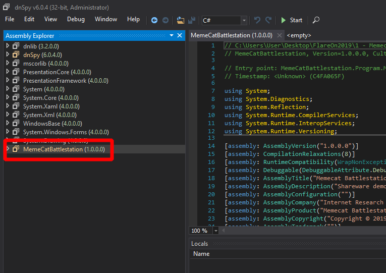

Memecat Battelstation
---

```
Welcome to the Sixth Flare-On Challenge! 

This is a simple game. Reverse engineer it to figure out what "weapon codes" you need to enter to defeat each of the two enemies and the victory screen will reveal the flag. Enter the flag here on this site to score and move on to the next level.

* This challenge is written in .NET. If you don't already have a favorite .NET reverse engineering tool I recommend dnSpy

** If you already solved the full version of this game at our booth at BlackHat  or the subsequent release on twitter, congratulations, enter the flag from the victory screen now to bypass this level.
```

```
$ file MemeCatBattlestation.exe
MemeCatBattlestation.exe: PE32 executable (GUI) Intel 80386 Mono/.Net assembly, for MS Windows
```

- [Introduction](#introduction)
- [Information collecting](#information-collecting)
- [Solution](#solution)

## Introduction

So this is the first Flare-on 2019 challenge.

Stated in the message that this is a DotNet executable as also confirmed by `file`.

Also in the message stated using `dnspy` tool which is a DotNet decompiler and debugger.

If flare-vm is installed it can be found in `FLARE\dotNET`, there are two types `dnspy-x86` which is for 32bit exe and `dnspy` which is for 64bit exe.

In our case the exe is 32bit so we are using `dnspy-x86`.

## Information collecting

We will collect how this exe works in order to know how to solve it.

To open the executable with dnspy, just drag the exe file into the left side of the program and it will be added.



Next is analysing the exe.

If we expanded the entry of MemeCatBattlestation, we would get some modules which are the components of a DotNet application along with `PE headers` (used for exe files) and `resouces` (mostly images and other raw files stored inside the same exe file).

Interestingly in `resources` has some cats?? images along with other images like `shareware_vectory`. we will check them in the code.

The main code is stored inside `MemeCatBattleStation` namespace.
which has 4 classes
- LogoForm
- Program
- Stage1Form
- Stage2Form
- VectoryForm

And `VectoryForm` seems very interesting.

inside it we see immediately `VictoryForm_Load` method:
``` C#
private void VictoryForm_Load(object sender, EventArgs e)
{
	byte[] array = new byte[]
    {
        9,
		8,
		19,
		17,
		9,
		55,
		28,
		18,
		15,
		24,
		10,
		49,
		75,
		51,
		45,
		32,
		54,
		59,
		15,
		49,
		46,
		0,
		21,
		0,
		65,
		48,
		45,
		79,
		13,
		1,
		2
    };
	byte[] bytes = Encoding.UTF8.GetBytes(this.Arsenal);
	for (int i = 0; i < array.Length; i++)
    {
		byte[] array2 = array;
		int num = i;
		array2[num] ^= bytes[i % bytes.Length];
	}
	this.flagLabel.Text = Encoding.UTF8.GetString(array);
}
```

This method, convert `Arsenal` String into byte[] then XOR it with `array`, convert the result into a String and assign it in `flagLabel` text object in the form.

From this `Arsenal` is the key to solve this challenge, so we need to know where it comes from.

Using `dnspy` right-click on `Arsenal` then click `Analyse`, in the bottom bar we see `Assigned By` (methods that assign/change this variable) and `Read By` (methods that read this variable).

We are interested in `Assigned By` and it is assigned in one location `Program.Main` method.

``` C#
private static void Main()
{
	Application.EnableVisualStyles();
	Application.SetCompatibleTextRenderingDefault(false);
	Application.Run(new LogoForm());
	Stage1Form stage1Form = new Stage1Form();
	Application.Run(stage1Form);
	if (stage1Form.WeaponCode == null)  // check 1
	{
		return;
	}
	Stage2Form stage2Form = new Stage2Form();
	stage2Form.Location = stage1Form.Location;
	Application.Run(stage2Form);
	if (stage2Form.WeaponCode == null)  // check 2
	{
		return;
	}
	Application.Run(new VictoryForm
	{
        // assignment of Arsenal
		Arsenal = string.Join(",", new string[]
		{
			stage2Form.WeaponCode,  // variables used in Arsenal
			stage1Form.WeaponCode   // we know these are not null based
                                    // based on check 1 and check 2
		}),
		Location = stage2Form.Location
	});
}
```

`string.join` joins and array with a separator "," in this case.

So important variables are
- Arsenal
- stage1Form.WeaponCode
- stage2Form.WeaponCode

## Solution

Using the same analysis on WeaponCode stage 1 and 2.
We get that all of them are assigned in method `FireButton_Click`:
``` C#
// Stage1Form
private void FireButton_Click(object sender, EventArgs e)
{
    // if value of WeaponCode if `true`
	if (this.codeTextBox.Text == "RAINBOW")
	{
		this.fireButton.Visible = false;
		this.codeTextBox.Visible = false;
		this.armingCodeLabel.Visible = false;
		this.invalidWeaponLabel.Visible = false;
		this.WeaponCode = this.codeTextBox.Text;    // Here
		this.victoryAnimationTimer.Start();
		return;
	}
	this.invalidWeaponLabel.Visible = true;
	this.codeTextBox.Text = "";
}
```
From above, easily we can see that WeaponCode will be "RAINBOW" because it is the only place assigned.

``` C#
// Stage2Form
private void FireButton_Click(object sender, EventArgs e)
{
    // Same as above but not as easy as ==
    // so if this is `true` WeaponCode will be `codeTextBox.Text`
	if (this.isValidWeaponCode(this.codeTextBox.Text))
	{
		this.fireButton.Visible = false;
		this.codeTextBox.Visible = false;
		this.armingCodeLabel.Visible = false;
		this.invalidWeaponLabel.Visible = false;
		this.WeaponCode = this.codeTextBox.Text;    // Here
		this.victoryAnimationTimer.Start();
		return;
	}
	this.invalidWeaponLabel.Visible = true;
	this.codeTextBox.Text = "";
}

// Check method
private bool isValidWeaponCode(string s)
{
	char[] array = s.ToCharArray();
	int length = s.Length;
    for (int i = 0; i < length; i++)
	{
	    char[] array2 = array;
		int num = i;
		array2[num] ^= 'A';
	}
	return array.SequenceEqual(new char[]
	{
		'\u0003',
		' ',
		'&',
		'$',
		'-',
		'\u001e',
		'\u0002',
		' ',
		'/',
		'/',
		'.',
		'/'
	});
}
```
- '^' operator is XOR.
- `array.SequenceEqual(other)` will return true if `array` and `other` are equal.

In `isValidWeaponCode` method is XOR `string s` (arg) with 'A' (0x41) and comparing the result with the `char[]` at the end.

Because XOR can be done again to reverse a previous XOR

i.e.
( 1 ^ 5 ) ^ 5 == 1

using this we can retrieve the correct `string s`
``` C#
char[] result = new char[]
{
	'\u0003',
	' ',
	'&',
	'$',
	'-',
	'\u001e',
	'\u0002',
	' ',
	'/',
	'/',
	'.',
	'/'
};

for (int i = 0; i < result.Length; i++)
{
	result[i] ^= 'A';
}

string stage2pass = new string(result);
```

The final result of the above code is `Bagel_Cannon`.

Using all the above information.

``` C#
stage2Form.WeaponCode = "Bagel_Cannon";
stage1Form.WeaponCode = "RAINBOW";

Arsenal = "Bagel_Cannon,RAINBOW";
```

Now if we decoded the array in `VictoryForm_Load` using `Arsenal` we get
```
Kitteh_save_galixy@flare-on.com
```
