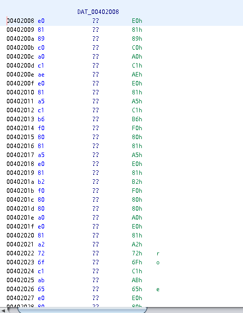

Overlong <!-- omit in toc -->
---

```
The secret of this next challenge is cleverly hidden. However, with the right approach, finding the solution will not take an <b>overlong</b> amount of time.
```

```
$ file Overlong.exe 
Overlong.exe: PE32 executable (GUI) Intel 80386, for MS Windows
```

- [Introduction](#introduction)
- [Solution](#solution)

## Introduction

In binary exe like this, we would mostly work with assembly.

Some popular tools to use are `radare2`, `IDA` and `Ghidra`.

This time I'll be using `Ghidra`.

## Solution

After opening the exe in `Ghidra` we find that there is only 3 functions, and no `main`. But there is `entry` function which is the entry point of the binary.

Decompilation of `entry`:

``` C
undefined4 entry(void)
{
  byte local_88 [128];
  uint local_8;
  
  local_8 = FUN_00401160(local_88,&DAT_00402008,0x1c);
  local_88[local_8] = 0;
  MessageBoxA((HWND)0x0,(LPCSTR)local_88,s_Output_00403000,0);
  return 0;
}
```

From above it calls `FUN_00401160` with `DAT_00402008`(global variable) and `0x1c`, similar to `memcpy` of some sort.

Because `local_88` is a result buffer, maybe `DAT_00402008` is a buffer/string too.



It doesn't seem like a valid string.

In `Ghidra` we can force data type to a buffer or memory location, so maybe telling `Ghidra` that this should be treated as a String.

right-click on `DAT_00402008` -> Data -> TerminatedCString

And looks like this works.

Looking back to `entry`
``` C
local_8 = FUN_00401160(local_88,(byte *)
                                 "I never broke the encoding:
                                 I_a_M_t_h_e_e_n_C_o_D_i_n_g@flare-on.com",0x1c);
```

I'm not sure how this works, and why before it didn't, maybe related to unicode encoding or something.
But this is the flag.

```
I_a_M_t_h_e_e_n_C_o_D_i_n_g@flare-on.com
```

