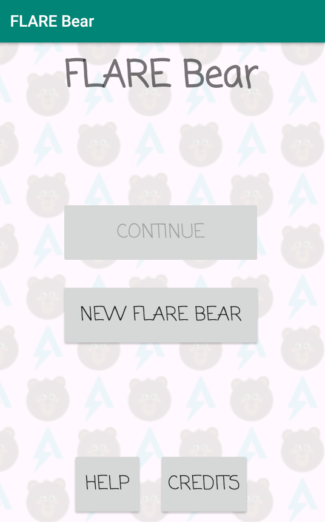
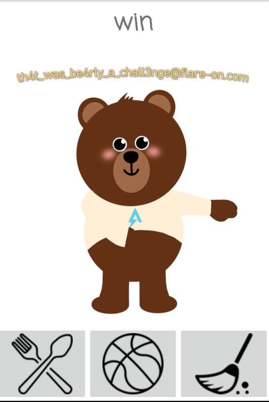

Flarebear <!-- omit in toc -->
---

```
We at Flare have created our own Tamagotchi pet, the flarebear. He is very fussy. Keep him alive and happy and he will give you the flag.
```

```
$ file flarebear.apk 
flarebear.apk: Zip archive data, at least v?[0] to extract
```

- [Introduction](#introduction)
- [Information Collection](#information-collection)
- [Solution](#solution)
  - [Running The App](#running-the-app)

## Introduction

This challenge is on Android (apk) even that `file` says its `zip` but essentially (apk) files are `zip` archives.

In this challenge we will use `jadx-gui` tool which is a tool that decompile (apk) files
to java, resources files, and other files used in android.

## Information Collection

When opening the (apk) in `jadx-gui` we see 6 packages:
- `android`
- `androidx`
- `com.fireeye.flarebear`
- `kotlin`
- `kotlinx.android`
- `org`

everything besides `com.fireeye.flarebear` is a library for android.

Also from above we see that this App is built with `kotlin` but `jadx-gui` will show it in java.

There are many classes in `com.fireeye.flarebear`.

Starting with `MainActivity` class which is the First activity the application start from,
interesting methods are:
- `newGame` methods launches `NewActivity` which has
    - `showFlareBear` that looks like it responds to an event and launches `FlareBearActivity`.
- `continueGame` which loads info of a game and launches `FlareBearActivity`.

So `FlareBearActivity` is the main point in this app.

in `FlareBearActivity` there are many methods, and the interesting ones are:
- `danceWithFlag` loads two raw resources as bytes[] decrypt them with password generated with `getPassword` and use them as Bitmap, then call `dance` on them which displays them.
- `decrypt` looks like it decrypt byte[] which was encrypted using AES using a password argument.
- `getPassword` looks like it gets data of `SharedPreferences` 'f', 'p', 'c' and use them to generate a password.
- `setMood` the method which calls `danceWithFlag`.

So it appears all these interesting methods are related by `danceWithFlag`.

In `setMood`, `danceWithFlag` is being called `if (isHappy && isEcstatic == true)`
``` java
public final boolean isHappy() {
    // ratio between 'p' and 'f' is between 2.0 and 2.5
    double stat = (double) (((float) getStat('f')) / ((float) getStat('p')));
    return stat >= 2.0d && stat <= 2.5d;
}

public final boolean isEcstatic() {
    // 0 is a default value if no value exists for the `key` passed
    int state = getState("mass", 0);
    int state2 = getState("happy", 0);
    int state3 = getState("clean", 0);
    if (state == 72 && state2 == 30 && state3 == 0) {
        return true;
    }
    return false;
}
```

These `getState` methods will try to get a value from ``SharedPreferences``.

Let's start with tackling `isEcstatic`:
<br>
`("mass", "happy", "clean")` are being used as keys to store values in ``SharedPreferences`erences`.

``` java
public final void changeMass(int i) {
    String str = "mass";
    setState(str, getState(str, 0) + i);
}

public final void changeHappy(int i) {
    String str = "happy";
    setState(str, getState(str, 0) + i);
}

public final void changeClean(int i) {
    String str = "clean";
    setState(str, getState(str, 0) + i);
}
```
which increments by the amount of `str` by `i`.

these methods are called from

``` java
// all the methods have some trunked code
public final void feed(@NotNull View view) {
    saveActivity("f");
    changeMass(10);
    changeHappy(2);
    changeClean(-1);
}

public final void play(@NotNull View view) {
    saveActivity("p");
    changeMass(-2);
    changeHappy(4);
    changeClean(-1);
}

public final void clean(@NotNull View view) {
    saveActivity("c");
    changeMass(0);
    changeHappy(-1);
    changeClean(6);
    setMood();
}
```
These methods increment/decrement `mass`, `happy` and `clean` by different amounts, and the final results should be

Also because `clean` calls `setMood` at the end then `clean` should be the last to be called.

``` java
mass == 72 && happy == 30 && clean == 0
```

## Solution

Just guessing the combination is easy.

If:
- fed 8 times
- played 4 times
- cleaned 2 times

We would fulfil all the numbers above:

``` java
// step 1
mass = 0
happy = 0
clean = 0

feed * 8:
    mass += 10 * 8
    happy += 2 * 8
    clean += (-1) * 8

// step 2
mass = 80
happy = 16
clean = -8

play * 4:
    mass += (-2) * 4
    happy += 4 * 4
    clean += (-1) * 4

// step 3
mass = 72
happy = 32
clean = -12

clean * 2:
    mass += 0 * 2
    happy += (-1) * 2
    clean += 6 * 2

// final result
mass = 72
happy = 30
clean = 0

// requirements fulfilled
```

Now we can make `isEcstatic` return `true`, but we haven't solved `isHappy` yet.

> Note: now we don't need to solve further and we don't need to analyse `isHappy`. But I will just write how it works. If you want to skip, [here](#running-the-app).

In each `feed`, `play` and `clean`, there is a call to `saveActivity` with arguments passed `'f'`,`'p'` and `'c'`.

In `saveActivity` it gets the value of `"activity"` from `SharedPreferences`, then appends the result String with the char passed to `saveActivity`, then store it again in `"activity"`.

So in short it just appends a char to `SharedPreferences` value.

And in `getState` which takes a char as an argument, it gets this `"activity"` value from `SharedPreferences` then returns the number of occurrences of the char argument in the resulting string.

So what `isHappy` is telling is that the ratio of the number of times `feed` is called and the number of times `play` is called should be in the range 2.0 and 2.5 (inclusive).

And in our solution:
- feed = 8
- play = 4
- clean = 2

it is true as:
```
8 / 4 == 2.0
```

### Running The App

Then we can use the info above to solve it manually (statical analysis).
But manually would be easier, because of the process taking in generating the password and decrypting them.

After installing the app in the emulator



After creating a new flare bear


Starting from `feed` then `play` and `clean`.



We get the flag:
```
th4t_was_be4rly_a_chall3nge@flare-on.com
```

It was way easier that just manually decrypting it.
And because we examined the code, we know it is not something dangerous and we used emulator just to be on the same side.

