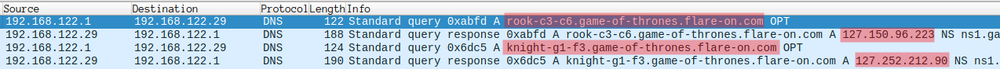

Dnschess
---

```
Some suspicious network traffic led us to this unauthorized chess program running on an Ubuntu desktop. This appears to be the work of cyberspace computer hackers. You'll need to make the right moves to solve this one. Good luck!
```

```
$ file capture.pcap ChessUI ChessAI.so 
capture.pcap: pcap capture file, microsecond ts (little-endian) - version 2.4 (Ethernet, capture length 262144)

ChessUI:      ELF 64-bit LSB pie executable, x86-64, version 1 (SYSV), dynamically linked, interpreter /lib64/ld-linux-x86-64.so.2, BuildID[sha1]=c30ec8b70e255aec7c93eb80321e4eab7bd52b3f, for GNU/Linux 3.2.0, stripped

ChessAI.so:   ELF 64-bit LSB shared object, x86-64, version 1 (SYSV), dynamically linked, BuildID[sha1]=ed3bd3fae8d4a8e27e4565f31c9af58231319190, stripped
```

- [Introduction](#introduction)
- [Information Collection](#information-collection)
- [Solution](#solution)

## Introduction

This time its a Linux executable along with a dynamic library
(.so) as stated in `file` output.

Also there is a (.pcap) file which is a capture of network traffic.

This challenge's name is `DNS`chess, so it has something to do with
`DNS` (Domain Name System) resolution which is a method for a device
to get the `IP` address of a website from its domain name. So this
`pcap` might have these captures.


## Information Collection

Lets check the `pcap` file first:



All the `pcap` is just `DNS` requests and responds, highlighted the
first two. From the picture it appears that the app sends a request
to a subdomain of `game-of-thrones.flare-on.com`. And this subdomain
appears to be kind of a chess piece move.

Example:
- move `rock`   from `c3` to `c6`.
- move `knight` from `g1` to `f3`. 

That's a really weird to send a chess move into a server.

<br>
Next, lets look at the game. ChessUI first.

We are going to use `Ghidra` also for this challenge.

In this challenge there is a main function, so lets check it.
``` C
// this code is generated using `Ghidra`'s decompilation.
int main(int uParm1,char *uParm2)
{
    int iVar1;
    undefined8 uVar2;
    undefined8 uVar3;
    
    DAT_0010d118 = gtk_target_entry_new("x-chessblaster/move",1,0);
    DAT_0010d108 = gtk_target_list_new(DAT_0010d118,1);
    uVar2 = gtk_application_new("com.flare-on.chessblaster",0);

    // FUN_00103ab0 seems interesting because its the only
    // function refernce.
    // Ghidra, puts `FUN_` if the global reference is a function
    // and `DAT_` if its normal data. 
    g_signal_connect_data(uVar2,"activate",FUN_00103ab0,0,0,0);
    uVar3 = g_application_get_type();
    uVar3 = g_type_check_instance_cast(uVar2,uVar3);
    iVar1 = g_application_run(uVar3,(ulong)(uint)uParm1,uParm2);
    g_object_unref(uVar2);
    return iVar1;
}
```

From the main function, and after some research. it turned out that this is a gnome application.


This is an example of `Hello World` of `gnome` application:

``` C
#include <gtk/gtk.h>

// this is being referenced the same way as `FUN_00103ab0`
static void
activate (GtkApplication *app, pointer user_data)
{
    GtkWidget *window;
    GtkWidget *label;

    window = gtk_application_window_new (app);
    label = gtk_label_new ("Hello GNOME!");
    gtk_container_add (GTK_CONTAINER (window), label);
    gtk_window_set_title (GTK_WINDOW (window), "Welcome to GNOME");
    gtk_window_set_default_size (GTK_WINDOW (window), 200, 100);
    gtk_widget_show_all (window);
}

int
main (int argc, char **argv)
{
    GtkApplication *app;
    int status;

    app = gtk_application_new (NULL, G_APPLICATION_FLAGS_NONE);
    g_signal_connect (app, "activate", G_CALLBACK (activate), NULL);
    status = g_application_run (G_APPLICATION (app), argc, argv);
    g_object_unref (app);

    return status;
}
```

<br>
`FUN_00103ab0` is interesting, so let's check it:

``` C
void FUN_00103ab0(undefined8 uParm1)
{
    /*
        removed uninteresting local variables
    */
    undefined8 error_holder;
    long chessAILib;
    undefined *getAIName_func;
    undefined *getAIGreeting_func;
    
    /*
    ...

    Code removed from here because it is about `gnome` GUI and didn't seem interesting. 
        
    ...
    */

    // opens the `ChessAI` shared library file
    chessAILib = dlopen("./ChessAI.so",1);
    if (chessAILib != 0) {

        // gets `getAiName` function reference.
        getAIName_func = (undefined *)dlsym(chessAILib, "getAiName");
        if (getAIName_func == (undefined *)0x0) {
            error_holder = dlerror();
            __fprintf_chk(stderr,1,"%s: %s\n","dlsym",error_holder);
        }

        // gets `getAiGreeting` function reference.
        getAIGreeting_func = (undefined *)dlsym(chessAILib, "getAiGreeting");
        if (getAIGreeting_func == (undefined *)0x0) {
            error_holder = dlerror();
            __fprintf_chk(stderr,1,"%s: %s\n","dlsym",error_holder);
        }

        // gets `getNextMove` function reference.
        `_global_getNextMove_func` = dlsym(chessAILib, "getNextMove");
        if (_global_getNextMove_func == 0) {
            error_holder = dlerror();
            __fprintf_chk(stderr,1,"%s: %s\n","dlsym",error_holder);
        }

        // call getAIName and getAIGreeting and store results
        // in global variables
        DAT_0010d078 = (*(code *)getAIName_func)();
        DAT_0010d070 = (*(code *)getAIGreeting_func)();
        /*
            cleaning up
        */

        // this seems to start the game loop and logic
        FUN_00103a40(0,0);
        return;
    }
    /*
        case if the library file was not found
    */
}
```

Lets decode the above function After removing uninteresting code (`gnome` related).

- It opens `ChessAi.so` library and gets three functions:
    - getAIName
    - getAIGreeting
    - getNextMove
- `getAIName` and `getAIGreeting` are called once and the result is stored in global variables. After that the function is not being called again.
- `getNextMove` is not being called in this function but instead is being stored in a global variable. So its mostly called from other places.
- `FUN_00103a40` which seems an interesting function because its the only way
to go next is being called.

We are not analysing `FUN_00103a40` as we can get XREF of
`_global_getNextMove_func` as it seems more interesting.

We get two XREF of `_global_getNextMove_func`:
- A `mov` instruction, which is the instruction that stores the reference to it.
So its not interesting now.
- A `call` instruction from `FUN_00104310` which is more interesting.

``` C
int FUN_00104310(uint *arg1)
{
    iVar2 = (*_global_getNextMove_func)
                ((ulong)DAT_0010d120,   // global counter
                arg1 + 2,               // pointer after arg[0] and arg[1]
                (ulong)*arg1,           // arg1[0]
                (ulong)arg1[1],         // arg[1]
                &local_138);            // place holder for buffer

    /*
    ...
        removed code
    ...
    */
    DAT_0010d120 = DAT_0010d120 + 1; // global counter, increment
}
```

We still can't make anything out of the above code.

Now we need to go to `ChessAI.so` library.

Listing for the three used functions from `ChessAI.so` library:

``` C
char *getAiGreeting(void)
{
    return "Finally, a worthy opponent. Let us begin";
}

char *getAiGreeting(void)
{
  return "Finally, a worthy opponent. Let us begin";
}

// removed unimportant code from below
ulong getNextMove(uint arg1,char *arg2,uint arg3,uint arg4,uint *arg5)
{
    hostent *hostNetStruct;
    ulong returnValue;
    char buffer [72];
    char *ipAddress;
    
    // start the string with `arg2`
    // from below, this is the chess piece name. (rook, knight, ...)
    strcpy(buffer,arg2);

    // unknown function
    // from below, arg3 is `from` location of chess piece move
    // `FUN_00101145` will translate it into the correct form and
    // `strcat` it with `buffer`.
    //
    // same way `arg4` is the `to` location of movement.
    FUN_00101145(buffer,(ulong)arg3,(ulong)arg3);
    FUN_00101145(buffer,(ulong)arg4,(ulong)arg4);

    // add the main domain for the DNSchess
    strcat(buffer,".game-of-thrones.flare-on.com");

    // refer below to man of `gethostbyname`
    hostNetStruct = gethostbyname(buffer);

    if (
        // if hostNetStruct == NULL
        (hostNetStruct == (hostent *)0x0) ||
        // get the ip address and check if the first part is not equal to (127)
        (ipAddress = *hostNetStruct->h_addr_list, *ipAddress != 0x7f) ||
        // check if the last part of ip is odd
        ((ipAddress[3] & 1U) != 0) ||
        // check if the lowest 4 bits of the third part of the ip is 
        // not equal to the `arg1` which is the global counter from
        // chessUI
        (arg1 != ((uint)(byte)ipAddress[2] & 0xf))) {
            // not sure what does 2 mean
            returnValue = 2;
        // return
    } else {
        // if ALL above is false

        sleep(1);

        // DAT_00102020 is a binary data (check below)
        //
        // DAT_00104060 is '\0' * 30 + "@flare-on.com"
        //
        // so DAT_00104060 is the flag location
        // and DAT_00102020 is the flag encrypted by XORed
        // with the second value of the ip address at the location of arg1
        // two bytes are XORed at a time with one key
        (&DAT_00104060)[(ulong)(arg1 * 2)] = (&DAT_00102020)[(ulong)(arg1 * 2)] ^ ipAddress[1];
        (&DAT_00104060)[(ulong)(arg1 * 2 + 1)] = (&DAT_00102020)[(ulong)(arg1 * 2 + 1)] ^ ipAddress[1];

        // set some values for arg5 buffer in the first two slots
        *arg5 = (uint)((byte)ipAddress[2] >> 4);
        arg5[1] = (uint)((byte)ipAddress[3] >> 1);

        /*
        `PTR_s_A_fine_opening_00104120` is a pointer to an array
        with statements like:
        - "A fine opening"
        - "Still within book"
        - "Interesting gambit"
        - "I must find counterplay"
        - "That's risky..."
        and more...
        */
        // copy one of the statements to arg5, but after 2 values
        strcpy((char *)(arg5 + 2),(&PTR_s_A_fine_opening_00104120)[(ulong)arg1]);
        
        returnValue = (ulong)((byte)ipAddress[3] >> 7);
    }

    return returnValue;
}
```

part of `man gethostbyname`:

``` C
struct hostent *gethostbyname(const char *name);
struct hostent {
    char  *h_name;            /* official name of host */
    char **h_aliases;         /* alias list */
    int    h_addrtype;        /* host address type */
    int    h_length;          /* length of address */
    // the only used is `h_addr_list` in the getNextMove
    char **h_addr_list;       /* list of addresses */
}
```

the content of `DAT_00102020`, len == 30: 

```
79 5a b8 bc ec d3 df dd 99 a5 b6 ac 15 36 85 8d 09 08 77 52 4d 71 54 7d a7 a7 08 16 fd d7
```

In conclusion:
- there is some intensive check at the beginning of `getNextMove`, and if they all passed. Then two bytes are decrypted and stored into the flag string buffer.
    - hostNetStruct must be NOT NULL
    - the first entry in the ip address is (127)
    - the last entry in the ip address is not odd
    - the lowest 4 bits of the third entry in the ip address is equal to the counter passed as `arg1` to `getNextMove` 
- `DAT_00102020` is the encrypted flag, its encrypted by XOR with the second
value of the ip address which is being obtained from the DNS server if the checks passed.
- each two subsequent values from `DAT_00102020` is being encrypted by the same key.
    - `79` & `5a`
    - `b8` & `bc`
    - ...
- the pcap attached is mostly a recording of someone who won the game. All IP address are stored in it.

## Solution

Because we know that the key to win is in the resounds of the DNSs in the pcap file, we need to extract them.

In Wireshark. The address of a DNS respond is in:
- DNS (respond)
    - Answers
        - `the domain name`
            - Address <- HERE

To Export it:
1) Apply the `Address` as a column.
2) File -> Export Packet Dissections -> As CSV (or any other)
3) `cut -f7 -d,  data.csv | grep "127.*" -o > addresses.txt` 
to just extract the addresses and store them in `address.txt`

Now that this info is ready to use, we can decrypt the flag:

The solution is written in python [here](solution_script.py)

Highlights here:

- read the addresses from the file
``` python
addresses_file = open('addresses.txt', 'r')
addresses = []

for line in addresses_file.readlines():
    line = line.split('.')
    addresses.append(
        list(map(int, line))
    )
```

- putting the encoded flag in the code manually and initialize a new empty array
for the result flag.

``` python
encoded_flag = [121, 90, 184, 188, ...]

decoded_flag = [0] * len(encoded_flag)
```

from the checks in `getNextMove` the first two are always true, and we need to focus on the last two.

- decrypt the flag

``` python
for address in addresses:
    # address[3] is even
    if(address[3] & 0x1 == 0):
        index = address[2] & 0xf
        
        # decrypt two bytes
        decoded_flag[index * 2] = encoded_flag[index * 2] ^ address[1]
        decoded_flag[index * 2 + 1] = encoded_flag[index * 2 + 1] ^ address[1]

print("flag:", ''.join(map(chr, decoded_flag)) + "@flare-on.com")
```

In here because we don't have `arg1` which is being used as the index to which bytes to decrypt. But we know that to pass the checks `arg1` must be equal to the lowest 4 bits in `address[2]` so we use it.

When running the script we get

```
flag: LooksLikeYouLockedUpTheLookupZ@flare-on.com
```


