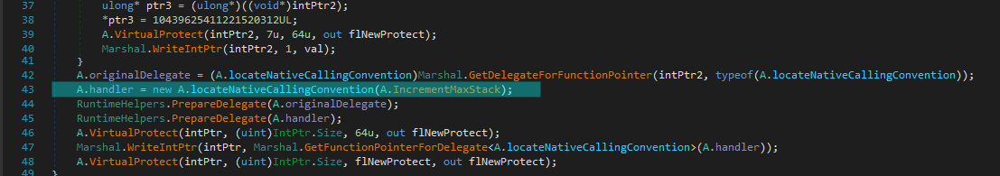
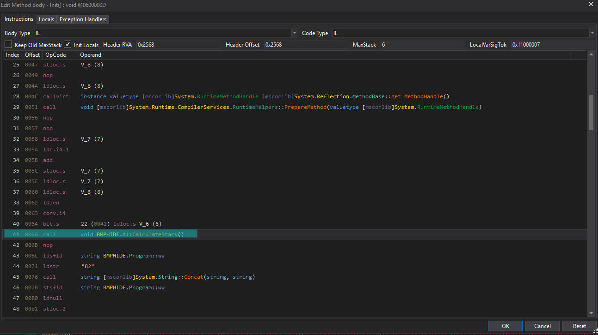

bmphide
---

```
Tyler Dean hiked up Mt. Elbert (Colorado's tallest mountain) at 2am to capture this picture at the perfect time. Never skip leg day. We found this picture and executable on a thumb drive he left at the trail head. Can he be trusted?
```

```
$ file bmphide.exe image.bmp 
bmphide.exe: PE32 executable (console) Intel 80386 Mono/.Net assembly, for MS Windows
image.bmp:   PC bitmap, Windows 3.x format, 1664 x 1248 x 24
```

- [Introduction](#introduction)
- [Information Collection](#information-collection)
- [Solution](#solution)

## Introduction

From `file` output this is a `.NET` executable, the same as `challenge 1`.
<br>
We can use `dnSpy-x86` because its `32 bit` executable. 

## Information Collection

This program has `3` namespaces

- A
- D
- Program (has Main)

``` C#
private static void Main(string[] args)
{
	Program.Init();
	Program.yy += 18;

    // the third argument as <output.bmp>
	string filename = args[2];
    // input file <input.bmp>
	string fullPath = Path.GetFullPath(args[0]);
    // input file <input.dat>  any type of file
	string fullPath2 = Path.GetFullPath(args[1]);
	byte[] data = File.ReadAllBytes(fullPath2);
	Bitmap bitmap = new Bitmap(fullPath);

	byte[] data2 = Program.h(data);
	Program.i(bitmap, data2);
	bitmap.Save(filename);
}

private static void Init()
{
    Program.yy *= 136;
    Type typeFromHandle = typeof(A);
    Program.ww += "14";
    MethodInfo[] methods = typeFromHandle.GetMethods(BindingFlags.DeclaredOnly | BindingFlags.Instance | BindingFlags.Static | BindingFlags.Public | BindingFlags.NonPublic);
    foreach(MethodInfo methodInfo in methods)
    {
        RuntimeHelpers.PrepareMethod(methodInfo.MethodHandle);
    }
    A.CalculateStack();
    Program.ww += "82";
    MethodInfo m = null;
    MethodInfo m2 = null;
    MethodInfo m3 = null;
    MethodInfo m4 = null;
    Program.zz = "MzQxOTk=";
    foreach(MethodInfo methodInfo2 in typeof(Program).GetMethods())
    {
        bool flag = methodInfo2.GetMethodBody() != null;
        if (flag)
        {
            byte[] ilasByteArray = methodInfo2.GetMethodBody().GetILAsByteArray();
            bool flag2 = ilasByteArray.Length > 8;
            if (flag2)
            {
                byte[] array2 = new byte[ilasByteArray.Length - 2];
                Buffer.BlockCopy(ilasByteArray, 2, array2, 0, ilasByteArray.Length - 2);
                D d = new D();
                uint num = d.a < byte > (array2);
                bool flag3 = num == 3472577156u;
                if (flag3)
                {
                    m = methodInfo2;
                } else {
                    bool flag4 = num == 2689456752u;
                    if (flag4) {
                        m2 = methodInfo2;
                    } else {
                        bool flag5 = num == 3040029055u;
                        if (flag5) {
                            m3 = methodInfo2;
                        } else {
                            bool flag6 = num == 2663056498u;
                            if (flag6) {
                                m4 = methodInfo2;
                            }
                        }
                    }
                }
            }
        }
    }
    A.VerifySignature(m, m2);
    A.VerifySignature(m3, m4);
}

// encode each bytes individually
public static byte[] h(byte[] data)
{
    byte[] array = new byte[data.Length];
    int num = 0;
    for (int i = 0; i < data.Length; i++)
    {
        int num2 = (int) Program.f(num++);
        int num3 = (int) data[i];
        num3 = (int) Program.e((byte) num3, (byte) num2);
        num3 = (int) Program.a((byte) num3, 7);
        int num4 = (int) Program.f(num++);
        num3 = (int) Program.e((byte) num3, (byte) num4);
        num3 = (int) Program.c((byte) num3, 3);
        array[i] = (byte) num3;
    }
    return array;
}

// write the data to pixels of the image
public static void i(Bitmap bm, byte[] data)
{
    int num = Program.j(103);
    for (int i = Program.j(103); i < bm.Width; i++)
    {
        for (int j = Program.j(103); j < bm.Height; j++)
        {
            bool flag = num > data.Length - Program.j(231);
            if (flag)
            {
                break;
            }
            Color pixel = bm.GetPixel(i, j);
            int red = ((int) pixel.R & Program.j(27)) | ((int) data[num] & Program.j(228));
            int green = ((int) pixel.G & Program.j(27)) | (data[num] >> Program.j(230) & Program.j(228));
            int blue = ((int) pixel.B & Program.j(25)) | (data[num] >> Program.j(100) & Program.j(230));
            Color color = Color.FromArgb(Program.j(103), red, green, blue);
            bm.SetPixel(i, j, color);
            num += Program.j(231);
        }
    }
}
```

In short, it takes an image and a data files, decode the data file and set
pixel colors in the input image with the data, lastly, saves the image in
the `output image` argument.

Important methods:
- `Program.Init`
- `Program.h`
- `Program.i`

From `Program.Init` there is `A.calculateStack` which calls `A.IdentifyLocals` and that seems complex.

`D.a` looks like some kind of hash function
``` C#
public uint a<T>(IEnumerable<T> byteStream)
{
	return ~byteStream.Aggregate(uint.MaxValue, (uint checksumRegister, T currentByte) => this.m_checksumTable[(int)((checksumRegister & 255u) ^ (uint)Convert.ToByte(currentByte))] ^ checksumRegister >> 8);
}
```

When running the program with the argument, we get an image that is not **visually** different from the input.

The best is to try to debug this.

When trying to debug, we get an error `StackOverfLowException` and that happen inside `Program.Init`.
<br>
But when trying without debugging, we can run it normally.
<br>
Looks like an `anti-debugging` technique is used here.

### removing anti-debugging

When the exception is thrown, we can see the call stack of the program.
<br>
We see that a very large call stack is there with alternating calls to
- `A.c`
- `A.IncrementMaxStack`

Then `Program.Init` and `Program.Main`.

`A.c` isn't refernced anywhere other than `A.IncrementMaxStack`.
<br>
And `A.IncrementMaxStack` isn't called directly but assigned as a handler to
some event/hook, which is set in `A.IdentifyLocals` which is called from
`A.calculateStack`. 




An idea, is to remove the invocation of `A.calculateStack` from `Program.Init` and see if that removes the anti-debugging.

We can do this by replacing the call instruction with `nop` instructions.

Using `dnSpy` we can edit `IL instruction` of any method.
<br>
In the view of `IL instructions` of `Program.Init` we can replace instruction with `nop`s with `R` shortcut or with the menu popup.



After edits, the binary must be saved `Save Module` from `File`.

Trying to run the program after the edit, and making sure the call to
`A.calculateStack` is not there. IT WORKS, and no exceptions are thrown.

But now, we need to know what was it doing, we can't just remove it, maybe there
was something important.

`A.IncrementMaxStack` looks it changes some functions memory data.
``` C#
private unsafe static uint IncrementMaxStack(IntPtr self, A.ICorJitInfo * comp, A.CORINFO_METHOD_INFO * info, uint flags, byte ** nativeEntry, uint * nativeSizeOfCode)
{
    bool flag = info != null;
    if (flag)
    {
        MethodBase methodBase = A.c(info - > ftn);
        bool flag2 = methodBase != null;
        if (flag2)
        {
            // 100663317 == 0x6000015
            // token of Program.h
            bool flag3 = methodBase.MetadataToken == 100663317;
            if (flag3)
            {
                uint flNewProtect;
                A.VirtualProtect((IntPtr)((void * ) info - > ILCode), info - > ILCodeSize, 4 u, out flNewProtect);
                Marshal.WriteByte((IntPtr)((void * ) info - > ILCode), 23, 20);
                Marshal.WriteByte((IntPtr)((void * ) info - > ILCode), 62, 20);
                A.VirtualProtect((IntPtr)((void * ) info - > ILCode), info - > ILCodeSize, flNewProtect, out flNewProtect);
            } else {
                // 100663316 == 0x6000014
                // token of Program.g
                bool flag4 = methodBase.MetadataToken == 100663316;
                if (flag4) {
                uint flNewProtect2;
                A.VirtualProtect((IntPtr)((void * ) info - > ILCode), info - > ILCodeSize, 4 u, out flNewProtect2);
                Marshal.WriteInt32((IntPtr)((void * ) info - > ILCode), 6, 309030853);
                Marshal.WriteInt32((IntPtr)((void * ) info - > ILCode), 18, 209897853);
                A.VirtualProtect((IntPtr)((void * ) info - > ILCode), info - > ILCodeSize, flNewProtect2, out flNewProtect2);
                }
            }
        }
    }
    return A.originalDelegate(self, comp, info, flags, nativeEntry, nativeSizeOfCode);
}
```

In short, the code above changes:
- Program.h (`0x6000015`)
    - offset  = 23(0x17), data = 20(0x14)
    - offset  = 62(0x3e), data = 20(0x14)
- Program.g (`0x6000014`)
    - offset  =  6(0x06), data = 309030853(0x126b6fc5) - little_endian(0xc56f6b12)
    - offset  = 18(0x12), data = 209897853(0x0c82c97d) - little_endian(0x7dc9820c)

So the program changes these values during runtime.
<br>
Didn't find any other things like that in calling `A.calculateStack`.

What we can do, is to modify the binary in these locations and remove the calling of `A.calculateStack`.

Using `dnSpy` hex editor to change values at these offsets. (using little_endian formats).

### Understanding `Init`

Now that fixed `Program.h` and `Program.g`

> I'll put these methods after understanding `Init`.

Now that we can debug normally.

The only thing need to be understood is
``` C#
/*
Init method, loops over all methods, checking its hash with
- 3472577156u
- 2689456752u
- 3040029055u
- 2663056498u
*/

// end of Init.
A.VerifySignature(m, m2);
A.VerifySignature(m3, m4);
```

when debugging:
``` C#
m   = Program.a;
m2  = Program.b;
m3  = Program.c;
m4  = Program.d;
```

And this is `A.VerifySignature`:
``` C#
public unsafe static void VerifySignature(MethodInfo m1, MethodInfo m2)
{
	RuntimeHelpers.PrepareMethod(m1.MethodHandle);
	RuntimeHelpers.PrepareMethod(m2.MethodHandle);
	int* ptr = (int*)((byte*)m1.MethodHandle.Value.ToPointer() + (IntPtr)2 * 4);
	int* ptr2 = (int*)((byte*)m2.MethodHandle.Value.ToPointer() + (IntPtr)2 * 4);
    *ptr = *ptr2;
}
```
In short, make handler of m1 point to the handler of m2.

So:
``` C#
Program.a = Program.b;
Program.c = Program.d;
```

We can apply these in `Program.h` to make static analysis easier by changing `IL instructions calls`.

This is the final result of `Program.h` and `Program.g`:
``` C#
public static byte[] h(byte[] data)
{
	byte[] array = new byte[data.Length];
	int num = 0;
	for (int i = 0; i < data.Length; i++)
	{
		int num2 = (int)Program.g(num++);
		int num3 = (int)data[i];
		num3 = (int)Program.e((byte)num3, (byte)num2);
		num3 = (int)Program.b((byte)num3, 7);
		int num4 = (int)Program.g(num++);
		num3 = (int)Program.e((byte)num3, (byte)num4);
		num3 = (int)Program.d((byte)num3, 3);
		array[i] = (byte)num3;
	}
	return array;
}

public static byte g(int idx)
{
	byte b = (byte)((long)(idx + 1) * (long)((ulong)309030853));
	byte k = (byte)((idx + 2) * 209897853);
	return Program.e(b, k);
}
```

Methods that need to be analysed are `b`, `d`, `e`, `g`, `j`(from `i`).

### Methods analysis

#### Program.b
``` C#
public static byte b(byte b, int r)
{
	for (int i = 0; i < r; i++)
	{
        // get the 8th bit
		byte b2 = (b & 128) / 128;
		b = (b * 2 & byte.MaxValue) + b2;
	}
	return b;
}
```
dividing by `128` for a byte is similar to ( >> 7).
multipying by `2` is similar to ( << 1).

So, this is `RotateLeft`.

#### Program.d
``` C#
public static byte d(byte b, int r)
{
	for (int i = 0; i < r; i++)
	{
		byte b2 = (b & 1) * 128;
		b = (b / 2 & byte.MaxValue) + b2;
	}
	return b;
}
```
This is similar to `b` but in reverse.
So, this is `RotateRight`.

#### Program.e
``` C#
public static byte e(byte b, byte k)
{
	for (int i = 0; i < 8; i++)
	{
		bool flag = (b >> i & 1) == (k >> i & 1);
		if (flag)
		{
			b = (byte)((int)b & ~(1 << i) & 255);
		}
		else
		{
			b = (byte)((int)b | (1 << i & 255));
		}
	}
	return b;
}
```
This is `XOR`. In a hard way.

#### Program.g
``` C#
public static byte g(int idx)
{
	byte b = (byte)((long)(idx + 1) * (long)((ulong)309030853));
	byte k = (byte)((idx + 2) * 209897853);
	return Program.e(b, k);
}
```
Looks like some kind of hash. Didn't try to understand it because it is
called always with the counter `num` and not with the data, so
the results may be constant.

#### Program.j
This is a very complex function, and its called with constants.
So we can replace all calls of `j` with its return value,
as we can get those from the debugger.

List of all values of `j()`:
- `j(103) == 0`
- `j(231) == 1`
- `j(27) == 248`
- `j(228) == 7`
- `j(230) == 3`
- `j(25) == 252`
- `j(100) == 6`

After edits:
``` C#
public static void i(Bitmap bm, byte[] data)
{
	int num = 0;
	for (int i = 0; i < bm.Width; i++)
	{
		for (int j = 0; j < bm.Height; j++)
		{
			bool flag = num > data.Length - 1;
			if (flag)
			{
				break;
			}
			Color pixel = bm.GetPixel(i, j);
			int red = ((int)pixel.R & 248) | ((int)data[num] & 7);
			int green = ((int)pixel.G & 248) | (data[num] >> 3 & 7);
			int blue = ((int)pixel.B & 252) | (data[num] >> 6 & 3);
			Color color = Color.FromArgb(0, red, green, blue);
			bm.SetPixel(i, j, color);
			num += 1;
		}
	}
}
```

Looks like its hiding the encoded data in the LSBs of the pixels.

## Solution

Now that we know the program hides data, this means `image.bmp` has hidden data
we need to extract.

We can reverse the work of this program. I'll be using python.

First, lets implement the functions inside `h`:
``` python
def G(idx):
    b = ((idx + 1) * 309030853) & 0xff
    k = ((idx + 2) * 209897853) & 0xff
    return b ^ k

def rightRotate(num, amount):
    for i in range(amount):
        num = ((num >> 1) & 0xff) + (num & 1) * 128
    
    return num & 0xff

def leftRotate(num, amount):
    for i in range(amount):
        num = ((num << 1) & 0xff) + ((num & 128) // 128)
    
    return num & 0xff

# and we have ^ for XOR
```

Next, we implement `h`:
``` python
data = extract_encoded_data()
    
data_len = len(data)

decoded_data = [0] * data_len

num = 0
counter = 0
for i in range(data_len):
    x = data[i]

    # generate all the Gs from the beginning
    firstF = G(num)
    num += 1
    secondF = G(num)
    num += 1
     
    x = leftRotate(x, 3)
    x ^= secondF
    x = rightRotate(x, 7)
    x ^= firstF

    decoded_data[i] = x
```

lastly, we need to extract these LSB data from the image
``` python
from PIL import Image

# img : PIL.Image object
# out : file
def extract_LSB_data(img, out):
    data = img.load()

    for i in range(img.width):
        for j in range(img.height):
            pixel = data[i, j]

            byte = 0
            byte |= (pixel[0] & 0b111)
            byte |= (pixel[1] & 0b111) << 8 - 5
            byte |= (pixel[2] & 0b11) << 8 - 2

            out.write(bytes([byte]))
```

packaged all the solution into `bmpunhide.py` script.

Running it:

image.bmp:


```
$ python bmpunhide.py image.bmp out.bmp
(===================)(100.00%)
```

out.bmp:


```
$ python bmpunhide.py out.bmp out2.bmp 
(===================)(100.00%)
```

out2.bmp:


Flag:
```
d0nT_tRu$t_vEr1fy@flare-on.com
```
