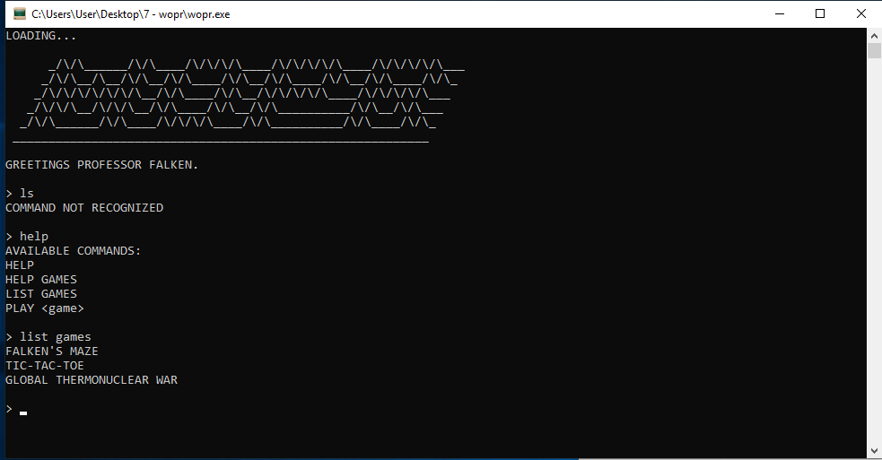
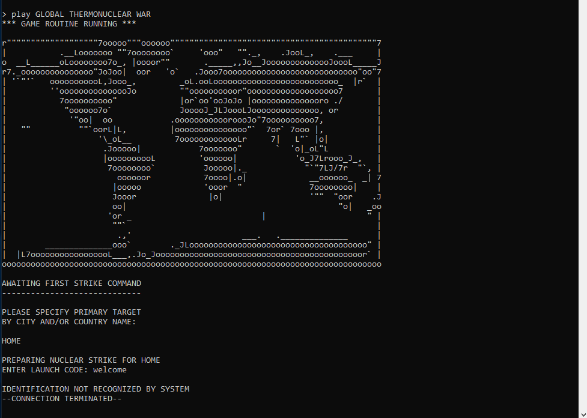

wopr <!-- omit in toc -->
---

```
We used our own computer hacking skills to "find" this AI on a military supercomputer. It does strongly resemble the classic 1983 movie WarGames. Perhaps life imitates art? If you can find the launch codes for us, we'll let you pass to the next challenge. We promise not to start a thermonuclear war.
```

```
$ file wopr.exe 
wopr.exe: PE32 executable (console) Intel 80386, for MS Windows
```
- [Introduction](#introduction)
- [Information Collection](#information-collection)
  - [Extracting Code](#extracting-code)
  - [Game Code Analysis](#game-code-analysis)
  - [wrong() function](#wrong-function)
    - [extracting EXE image](#extracting-exe-image)
    - [getting the MD5 hash](#getting-the-md5-hash)
- [Solution](#solution)

## Introduction
A normal Windows EXE.

Here are some screenshots



**(Spoiler)** Its written in `Python`.

## Information Collection

### Extracting Code
From the strings in this EXE, it appears that its a `Python` written executable.

```
__main__
PyList_New
PyModule_GetDict
Installing PYZ: Could not get sys.path\n
PyInstaller: pyi_win32_utils_to_utf8 failed.
```

It appears that its `PyInstaller` executable.

using [pyinstxtractor.py](https://github.com/countercept/python-exe-unpacker/blob/master/pyinstxtractor.py) to extract it.

```
$ python pyinstxtractor.py wopr.exe
[*] Processing wopr.exe
[*] Pyinstaller version: 2.1+
[*] Python version: 37
[*] Length of package: 5068358 bytes
[*] Found 64 files in CArchive
[*] Beginning extraction...please standby
[*] Found 135 files in PYZ archive
[*] Successfully extracted pyinstaller archive: wopr.exe

You can now use a python decompiler on the pyc files within the extracted directory
```

looking at the extracted directory, there are many files that are used by `PyInstaller`.
<br>
In this EXE, `PyInstaller` has two possible entrypoints:
- pyiboot01_bootstrap
- pyiboot02_cleanup

There is also an interesting file in the directory:
```
'this/key' (we will get back to this later).
```

The first one seems normal, but `pyiboot02_cleanup` has an interesting string:

```
Once upon a midnight dreary, while I pondered, weak and weary,

Over many a quaint and curious volume of forgotten lore- 

While I nodded, nearly napping, suddenly there came a tapping, 	 

As of some one gently rapping, rapping at my chamber door-  	

"'Tis some visitor," I muttered, "tapping at my chamber door-	 
 	   	 	 	 Only this and nothing more."	

................ /* trunked */		  
```

These startup files are just compiled python files `pyc` without the magic header. (just marshal bytes).

In order to use decompiler tools, we can add the MAGIC values from any `pyc`. (16 bytes).

then use `uncompyle6` to decompile it, we get [wopr_code.py](wopr_code.py).
> Because of using packages file `this\key` and converting tabs into spaces,
> I edited the code because it wouldn't work otherwise.

In `wopr` python script it does:
1) replace `print` and `exec` references.
2) do some `LZMA` decompression on `key` and `__doc__`.
3) call `print` on the decompressed data which is `exec` in this case and run
   the decompressed code.
   
So it decompresses a piece of code, If we change `print` to `exec` it will print it.

The code extracted is in [compressed_code.py](compressed_code.py)


### Game Code Analysis

In the compressed code, important parts are:
``` python
xor = [212, 162, 242, 218, 101, 109, 50, 31, 125, 112, 249, 83, 55, 187, 131, 206]
h = list(wrong())
h = [h[i] ^ xor[i] for i in range(16)]
# ... trunked

launch_code = input().encode()

# encoding map coordinates
x = list(launch_code.ljust(16, b'\0'))
b = 16 * [None]

# calculate missile trajectory
b[0] = x[2] ^ x[3] ^ x[4] ^ x[8] ^ x[11] ^ x[14]
b[1] = x[0] ^ x[1] ^ x[8] ^ x[11] ^ x[13] ^ x[14]
b[2] = x[0] ^ x[1] ^ x[2] ^ x[4] ^ x[5] ^ x[8] ^ x[9] 
# ... trunked

if b == h:
# ... trunked

    eye = [219, 232, 81, 150, 126, 54, 116, 129, 3, 61, 204, 119, 252, 122, 3, 209, 196, 15, 148, 173, 206, 246, 242, 200, 201, 167, 2, 102, 59, 122, 81, 6, 24, 23]
    flag = fire(eye, launch_code).decode()
```

We can get the flag if we know the value of `h`/`b`, then using `z3` to get `x` which is the input.
<br>
`h` is coming from `wrong()` function.

### wrong() function
We cannot call this function from python directly because it uses
`windll.kernel32.GetModuleHandleW(None)`. which return a pointer to the beginning of
the EXE image file loaded into memory.

Using that image, it does some computation and then return the `md5` of some binary content.

Instead of trying to decode the function, we can just run it with the image and see
the result `md5` hash.

We can extract the image from the debugger, and edit `wrong()` a bit so we it can run
independently of the executable.

#### extracting EXE image

In a process of PyInstaller program, it doesn't call python code directly.

It first, create a child process which runs the python code. In other words, we need to
follow the child process and extract it's image as its the image running during the call of
`windll.kernel32.GetModuleHandleW(None)` when the program is running.

`x32dbg` doesn't have the feature of following the child process, so we need
to do it manually.

We can do that, by calling `CreateProcess` and make the process **suspended**,
then attaching to that process, and resuming execution.

In `x32dbg` we can create breakpoints on `CreateProcessW` and `CreateProcessA`
(because I don't know which one is going to be called),
then changing the value of the parameter `dwCreationFlags` to `0x4 = (CREATE_SUSPENDED)`.

After attaching to the new process, we make a breakpoint in `GetModuleHandleA` (and `W`)
because it that point we know that we are in the middle of executing the python code and we
are in `wrong()`, and that the exe image will not change due to some relocations or anything.

Then we extract all the parts of the image from `Memory map` section, on my run the image
starts at `0x230000`, I extracted them all and grouped the files into one
`wopr_00230000_all.bin`.

#### getting the MD5 hash

after we get the image, we can use the below code to run `wrong()`.

The edits are minor, though the part `- 0x230000` might be different on your side. This was the base address of the executable in my memory.

``` python
def wrong():
    f = open("wopr_00230000_all.bin", "rb")
    trust = f.read()
    f.close()

    computer = string_at(trust, 1024)
    dirty, = struct.unpack_from('=I', computer, 60)

    _, _, organize, _, _, _, variety, _ =  struct.unpack_from('=IHHIIIHH', computer, dirty)
    assert variety >= 144

    participate, = struct.unpack_from('=I', computer, dirty + 40)
    for insurance in range(organize):
        name, tropical, inhabitant, reader, chalk, _, _, _, _, _ = struct.unpack_from('=8sIIIIIIHHI', computer, 40 * insurance + dirty + variety + 24)
        if inhabitant <= participate < inhabitant + tropical:
            break

    spare = bytearray(string_at(trust[inhabitant:], tropical))
    
    issue, digital = struct.unpack_from('=II', computer, dirty + 0xa0)
    truth = string_at(trust[issue:], digital)

    expertise = 0
    while expertise <= len(truth) - 8:
        nuance, seem = struct.unpack_from('=II', truth, expertise)

        if nuance == 0 and seem == 0:
            break

        slot = truth[expertise + 8:expertise + seem]

        for i in range(len(slot) >> 1):
            diet, = struct.unpack_from('=H', slot, 2 * i)
            fabricate = diet >> 12
            if fabricate != 3: continue
            diet = diet & 4095
            ready = nuance + diet - inhabitant
            if 0 <= ready < len(spare): 
                struct.pack_into('=I', spare, ready, struct.unpack_from('=I', spare, ready)[0] - 0x230000)

        expertise += seem

    return hashlib.md5(spare).digest()
```

And we get this result for `h` before XOR with `x` and after.
```
before XOR: [167, 191, 210, 158, 15, 1, 107, 83, 104, 55, 183, 96, 124, 186, 180, 168]
after XOR: [115, 29, 32, 68, 106, 108, 89, 76, 21, 71, 78, 51, 75, 1, 55, 102]
```

## Solution

Now that we have the value of `h`, we can use `z3` library to solve this giant system of equations and obtain `launch_code`.

This code can be used to get the following result
```python
from z3 import *

h = [115, 29, 32, 68, 106, 108, 89, 76, 21, 71, 78, 51, 75, 1, 55, 102]

x = [BitVec(f'x[{i}]', 8) for i in range(16)]
xx = 16 * [0] # stores the final result

b = [None] * 16
b[0] = x[2] ^ x[3] ^ x[4] ^ x[8] ^ x[11] ^ x[14]
b[1] = x[0] ^ x[1] ^ x[8] ^ x[11] ^ x[13] ^ x[14]
b[2] = x[0] ^ x[1] ^ x[2] ^ x[4] ^ x[5] ^ x[8] ^ x[9] ^ x[10] ^ x[13] ^ x[14] ^ x[15]
b[3] = x[5] ^ x[6] ^ x[8] ^ x[9] ^ x[10] ^ x[12] ^ x[15]
b[4] = x[1] ^ x[6] ^ x[7] ^ x[8] ^ x[12] ^ x[13] ^ x[14] ^ x[15]
b[5] = x[0] ^ x[4] ^ x[7] ^ x[8] ^ x[9] ^ x[10] ^ x[12] ^ x[13] ^ x[14] ^ x[15]
b[6] = x[1] ^ x[3] ^ x[7] ^ x[9] ^ x[10] ^ x[11] ^ x[12] ^ x[13] ^ x[15]
b[7] = x[0] ^ x[1] ^ x[2] ^ x[3] ^ x[4] ^ x[8] ^ x[10] ^ x[11] ^ x[14]
b[8] = x[1] ^ x[2] ^ x[3] ^ x[5] ^ x[9] ^ x[10] ^ x[11] ^ x[12]
b[9] = x[6] ^ x[7] ^ x[8] ^ x[10] ^ x[11] ^ x[12] ^ x[15]
b[10] = x[0] ^ x[3] ^ x[4] ^ x[7] ^ x[8] ^ x[10] ^ x[11] ^ x[12] ^ x[13] ^ x[14] ^ x[15]
b[11] = x[0] ^ x[2] ^ x[4] ^ x[6] ^ x[13]
b[12] = x[0] ^ x[3] ^ x[6] ^ x[7] ^ x[10] ^ x[12] ^ x[15]
b[13] = x[2] ^ x[3] ^ x[4] ^ x[5] ^ x[6] ^ x[7] ^ x[11] ^ x[12] ^ x[13] ^ x[14]
b[14] = x[1] ^ x[2] ^ x[3] ^ x[5] ^ x[7] ^ x[11] ^ x[13] ^ x[14] ^ x[15]
b[15] = x[1] ^ x[3] ^ x[5] ^ x[9] ^ x[10] ^ x[11] ^ x[13] ^ x[15]

isEq = [None] * 16

for i in range(len(h)):
    isEq[i] = (b[i] == h[i])

solve(*isEq)
```

result

```
[x[14] = 77,
 x[8] = 76,
 x[11] = 50,
 x[3] = 71,
 x[1] = 67,
 x[10] = 73,
 x[6] = 89,
 x[12] = 89,
 x[9] = 87,
 x[2] = 48,
 x[4] = 55,
 x[13] = 88,
 x[7] = 50,
 x[0] = 53,
 x[5] = 84,
 x[15] = 66]
```

when compiled == `launch_code = "5C0G7TY2LWI2YXMB"`.

When running the program and supplying the `launch_code` we get the flag

```
L1n34R_4L93bR4_i5_FuN@flare-on.com 
```
