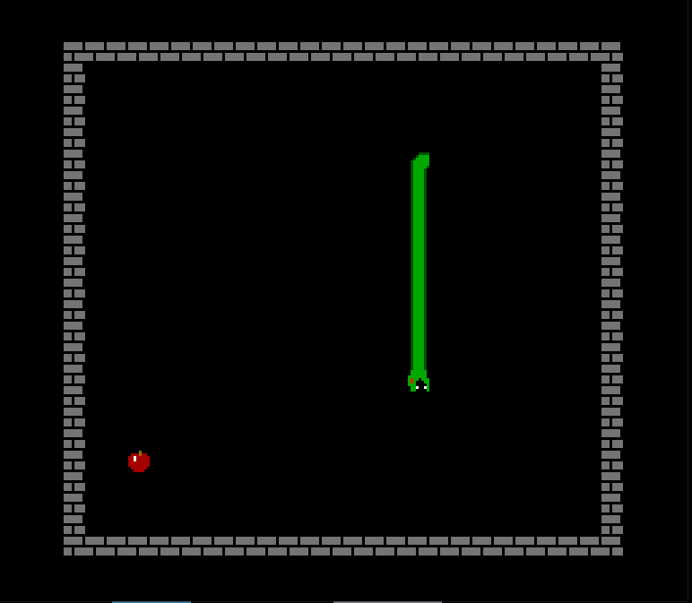
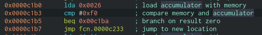
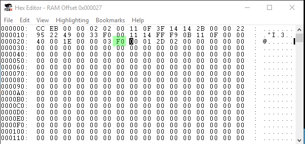
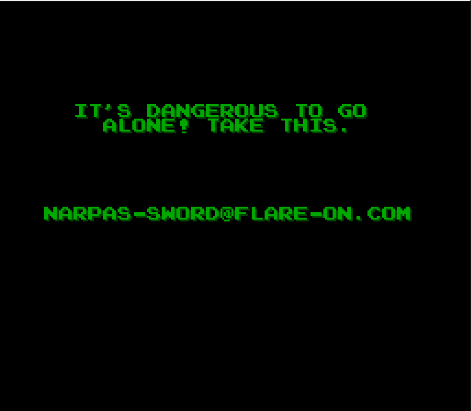

snake <!-- omit in toc -->
---

```
The Flare team is attempting to pivot to full-time twitch streaming video games instead of reverse engineering computer software all day. We wrote our own classic NES game to stream content that nobody else has seen and watch those subscribers flow in. It turned out to be too hard for us to beat so we gave up. See if you can beat it and capture the internet points that we failed to collect.
```

```
$ file snake.nes 
snake.nes: NES ROM image (iNES): 1x16k PRG, 1x8k CHR [V-mirror]
```
- [Introduction](#introduction)
- [Information Collection](#information-collection)
  - [Generating game trace](#generating-game-trace)
  - [Analyzing game trace](#analyzing-game-trace)
- [Solution](#solution)

## Introduction
A new interesting challenge. A NES game ROM image, first time dealing with something like this.

The NES uses `6502` CPU, the image contains binary code, and data about
color palettes used in the game, and patterns of sprites and background tiles(PPU).

There are some software to examine the sprites, so its easier than code. But the
most important is examining the assembly instructions. Not many
disassemblers support `6502` architecture.

A great resource to learn more about NES is [nesdev wiki](https://wiki.nesdev.com)

I'm using:
- `cutter (radare2)` to look at disassembly.
- `fceux` as an emulator/debugger/tracer.

We can view the PPU of the image using `fceux`, but its just normal sprites and
images. So we will go directly for the code.

## Information Collection

After looking into `6502` CPU, it turned out that when the CPU is reset. First,
it will do some initialization inside it, and then it will read **two** important
bytes from the memory, that is the reset vector or where the execution should start.
It is stored in memory `$fffc` and `$fffd` (hardcoded).

When loading the `.nes` file into `cutter`, we can see some functions loaded. Looking at the stated memory addresses, the reset vector is `$c000`.

During the competition, I saw a tip on `twitter` or a way of solving this challenge.
Tip: runt the code, and check which parts that are not called(executed), then focus 
on these parts. (By mistake before I reach to this challenge XD).

### Generating game trace

So that's what I did, I used the tracer tool. started tracing just the instruction
(I'm interested only in the instruction location). Reset the CPU to not miss anything,
and played the game.




When playing, I tried to cover all cases:
- eat apples.
- die by wall.
- die by eating yourself.

### Analyzing game trace

After generation of the game trace, the output is a file of **157MB**.

Sample:
```
$ head snake.log -n 5
FCEUX 2.2.2 - Trace Log File
$C1B3:C9 F0     CMP #$F0
$C1B5:F0 03     BEQ $C1BA
$C1B7:4C 33 C2  JMP $C233
$C233:AD 13 00  LDA $0013 = #$00
```

Because I'm interested in just the not executed code, I filtered everything except
for instruction address. using: (might not be the best, but works)
```
cat snake.log | cut -f1 -d: | cut -f2 -d$ | sort | uniq > snake_uniq.log
```

The resulting file is just **4.3KB**.

Then to Identify which code is not executed, I computed the difference between each
recorded instruction address, and extracted the addresses with large gap between.

```python
with open('snake_uniq.log', 'r') as f:
    lines = f.readlines()

# convert the hex string into int, so we can compute subtraction
addresses = [int(x, 16) for x in lines]

for i in range(len(addresses) - 1):
    # compute difference between each subsequent addresses
    tmp = addresses[i + 1] - addresses[i]
   
    # subsequent instruction normally differ by 2-3 bytes
    if tmp > 4:
        print(f'{hex(addresses[i])} - {hex(addresses[i + 1])} (l = {tmp})')
```

when running we get:
```
$ python extract.py
0xc1b7 - 0xc233 (l = 124)
0xc2aa - 0xc2b1 (l = 7)
0xc323 - 0xc328 (l = 5)
0xc42c - 0xc436 (l = 10)
0xc444 - 0xc467 (l = 35)
0xc58f - 0xc59f (l = 16)
0xc5c3 - 0xc5d3 (l = 16)
0xc718 - 0xc71d (l = 5)
0xc743 - 0xc74b (l = 8)
0xc835 - 0xc85b (l = 38)
```

The first one seems the most interesting. Looking at the code that result in the jump.



What this code does is:
1) load byte at memory `0x0026`
2) if it is equal to `0xf0` then jump to `$c1ba` (**not** executed in our case).
3) else go to `$c233` (executed in our case)

Looks so simple.

## Solution

Now that we found that the memory address `0x0026` is important, we need to edit it into `0xf0` to trigger that code block.

We can do this using the emulator's hex editor, during the gameplay.



When doing this, actually we get the flag. That easy.



```
NARPAS-SWORD@FLARE-ON.COM 
```